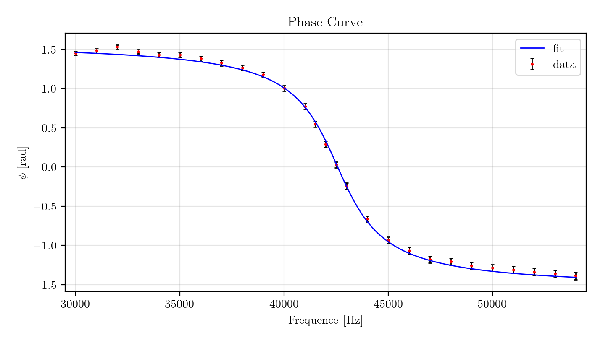
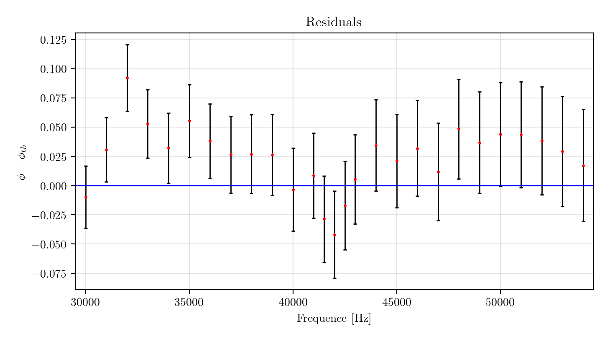

# RLC resonance curve non-linear fit analysis
The purpose of this notebook is to analyze in depth the non-linear fit of the resonance curve of a RLC circuit. All data have been collected with a Tektronix TBS 1102B oscilloscope and the errors have been computed according to the oscilloscope's documentation. Non-linear least squares are used through the powerful Minuit minimization library developed at CERN. The errors on parameters returned by Minuit are verified by computing the $\chi^2$ confidence ellipses and marginalizing them. Lastly 10000 toy datasets are simulated and analyzed, to verify that the distribution of best-fit estimates respects the confidence ellipses computed previously. 

## Table of contents
1. [Introduction](#introduction)
2. [Non-linear fit with Minuit](#fit)
3. [Profiling](#profiling)
4. [Probability maps and Marginalization](#probability)
5. [Simulation](#simulation)
6. [Results](#results)

## Introduction 
The quantities measured are the input frequence $f$, the transfer function $T$ and the difference in phase $\Delta \phi$. The resonance curve depends on 3 parameters to estimate: a scale factor $A$, the frequency of oscillations $\Omega$ and the dumping factor $\delta$. 
$$T(f) = \frac{A \cdot 2\pi f}{\sqrt{(2\pi f)^4 - 2(2\pi f)^2 (\Omega^2 - 2\delta^2) + \Omega^4}}$$
The phase curve depends on 3 parameters to estimate: the resistance $R$, the inductance $L$ and the capacitance $C$.
$$\Delta\phi(f) = \arctan\left(\frac{\frac{1}{2\pi f C} - 2\pi f L}{R}\right)$$
While both fits will be performed, only the first will be analyzed in depth. This is due to the strong correlation between $C$ and $L$ which makes the second fit unreliable. 
## Non-linear fit with Minuit 
The best-fit estimates are computed with Minuit by least squares: in both cases the algorithm needs initial values and a sum of squares function to minimize. These are the resulting plots with respective residuals.

  
   

  
   

## $\chi^2$ profiling 
Now, thanks to test vectors centred around the best-fit estimates, a 500 $\times$ 500 $\times$ 500 grid of $\chi^2$ values is computed and profiled with respect to the 3 parameters $A$, $\Omega$ and $\delta$. Profiling means minimizing the grid across one of the 3 dimensions. 
Here are the contour plots given by the 3 profiles, in addition to dashed lines identifying the error on parameters returned by Minuit:

  

Then $\chi^2_{min}$ (computed at the best-fit estimates) is subtracted from all profiles and new contour plots are displayed with levels set at critical values for the $\chi^2$ c.d.f. for 2 degrees of freedom, giving the 2 main confidence ellipses.

  

As the error on parameters are obtained by further profiling, it is expected that they perfectly frame the confidence ellipse given by $\chi^2 - \chi^2_{min} < 1$. This is indeed seen in all 3 cases.
## $\chi^2$ probability maps and marginalization 
The 3 profiles are then converted to probability maps by first applying the $\chi^2$ p.d.f. for 2 degrees of freedom and later normalising.  
Remember that $f(\chi^2 - \chi^2_{min}, 2) = e^{-\frac{\chi^2 - \chi^2_{min}}{2}}$.

  

Around 68.3% of the volume under the distribution should fall in the region delimited by $\chi^2 - \chi^2_{min} < 2.3$: this is successfully verified by summation. 
Now the probability maps are marginalized across both dimensions, giving the 6 possible p.d.f. of parameters. As the sample size is large these are expected to be normal. The area under the bells between $bf - \sigma_{bf}$ and $bf + \sigma_{bf}$ (where $bf$ stands for the best-fit estimate given by Minuit) is computed, and its compatibility with the expected 68.3% is checked.

  

## Simulation 
Lastly, around each datapoint 10k values are generated normally distibuted with variance equal to the variance of the datapoint. This gives 10k toy datasets, and for each the best-fit estimates are computed with Minuit. These are then scattered to visually check whether around 68.3% of them fall inside the confidence ellipse given by $\chi^2 - \chi^2_{min} < 2.3$. 

  

## Results 
Physicists perform non-linear fits all the time, and we often forget about the underlying complexity of the problem. In this project I verified successfully in different ways the error on parameters returned by the powerful minimizer Minuit. Most of the variability encountered can be attributed to the computational complexity of the problem. The more parameters we introduce in our model the more dimensions we add to the grid we then profile: in this case 3 dimensions are enough to push the computation time to over 3 hours with test arrays of size 500. In order to increase efficiency a first step would be to replace nested for loops used to profile with numpy native functions, such as np.meshgrid and np.minimum.reduce. This would cut the computation time down to 45 minutes. 